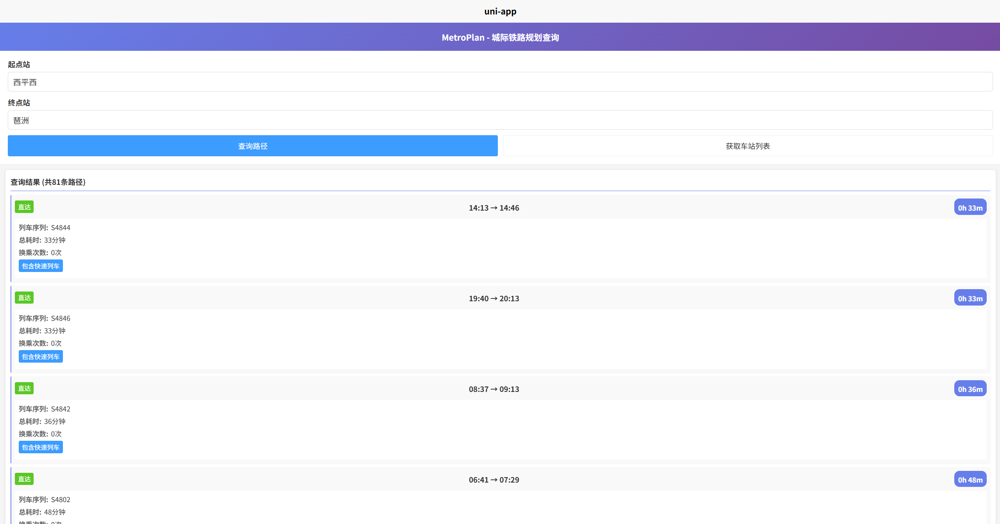
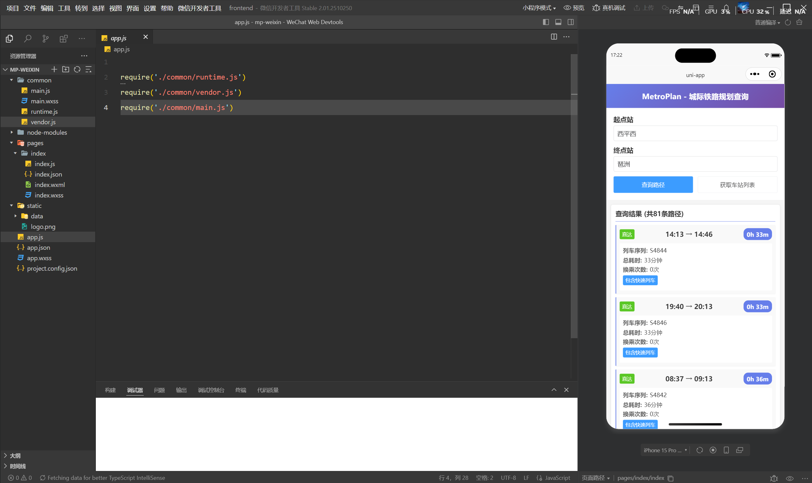

# MetroPlan - 广东城际轨道交通路径规划系统

<div align="center">

[](LICENSE)
[](https://nodejs.org/)
[](https://www.python.org/)
[](https://vuejs.org/)

一个综合性的城际轨道交通规划系统，提供广东省区域内的列车路径查询服务。

[功能特性](#功能特性) • [快速开始](#快速开始) • [项目架构](#项目架构) • [使用文档](#使用文档) • [开发指南](#开发指南)

</div>

---

## 📋 目录

- [项目概述](#项目概述)
- [功能特性](#功能特性)
- [技术栈](#技术栈)
- [项目架构](#项目架构)
- [快速开始](#快速开始)
  - [环境要求](#环境要求)
  - [后端部署](#后端部署)
  - [前端部署](#前端部署)
  - [数据处理工具](#数据处理工具)
- [使用文档](#使用文档)
  - [API 接口](#api-接口)
  - [前端使用](#前端使用)
- [实现原理](#实现原理)
  - [核心算法](#核心算法)
  - [数据结构](#数据结构)
  - [路径优化](#路径优化)
- [配置说明](#配置说明)
- [开发指南](#开发指南)
- [项目结构](#项目结构)
- [常见问题](#常见问题)
- [贡献指南](#贡献指南)
- [许可证](#许可证)

---

## 项目概述

**MetroPlan** 是一个专为广东省城际轨道交通设计的智能路径规划系统，旨在为乘客提供最优的出行方案。系统支持 **65 个车站**、**242 辆列车**的实时查询，能够在考虑换乘次数、时间窗口等约束条件下，快速计算出最优的出行路径。

### 项目目标

1. **智能路径规划**：基于深度优先搜索（DFS）算法，快速找出起点到终点的所有可行路径
2. **多方案对比**：自动合并相同车次序列的路径，提供多种换乘方案供用户选择
3. **时间优化**：根据列车时刻表计算精确的出发/到达时间和总耗时
4. **用户友好**：提供直观的 Web 界面，支持实时查询和结果展示
5. **可扩展性**：模块化设计，便于添加新的车站、线路和算法优化

### 应用场景

- 🚄 城际出行规划（如广州 → 深圳、佛山 → 肇庆等）
- 🔄 多次换乘优化（最多支持 2 次换乘）
- ⏱️ 时间窗口过滤（基于最快路线自动筛选合理方案）
- 📊 快速列车识别（标注城际快速列车）

### 页面展示






---

## 功能特性

### 核心功能

- ✅ **深度优先搜索算法**：高效的路径查找，支持 0-2 次换乘
- ✅ **智能路径合并**：自动合并相同车次序列的路径方案
- ✅ **时间窗口过滤**：基于最快路线的时间窗口过滤（可配置）
- ✅ **方向性验证**：确保换乘方案的方向性一致性
- ✅ **多语言支持**：支持中文站名和车次信息
- ✅ **快速列车标识**：自动识别并标注快速列车

### 前端特性

- 🎨 **现代化 UI**：紫色渐变主题，响应式设计
- 🔍 **实时查询**：输入起点/终点即可快速查询
- 📱 **跨平台支持**：基于 uni-app，支持 H5、小程序、APP 等多端
- 💡 **智能提示**：车站列表查看，输入验证
- 🎯 **结果可视化**：路径类型、耗时、换乘详情清晰展示

### 后端特性

- 🔒 **安全防护**：Helmet 安全头、CORS 配置、请求限流
- 📊 **日志记录**：Morgan 日志中间件，生产/开发环境分离
- ⚙️ **灵活配置**：环境变量管理，支持多环境部署
- 🧪 **测试覆盖**：Jest 单元测试，API 集成测试
- 🐳 **容器化支持**：Docker 和 Docker Compose 配置

---

## 技术栈

### 后端

| 技术 | 版本 | 用途 |
|------|------|------|
| **Node.js** | 14.0+ | 运行时环境 |
| **Express.js** | 4.18.2 | Web 框架 |
| **Python** | 3.8+ | 数据处理和算法实现 |
| **Flask** | Latest | Python API 服务（可选） |

**主要依赖**：
- `express`: Web 应用框架
- `cors`: 跨域资源共享
- `helmet`: 安全防护
- `morgan`: 日志记录
- `dotenv`: 环境变量管理
- `jest`: 单元测试框架

### 前端

| 技术 | 版本 | 用途 |
|------|------|------|
| **uni-app** | Latest | 跨平台开发框架 |
| **Vue.js** | 2.x | 前端框架 |
| **uView UI** | 2.0.36 | UI 组件库 |
| **SCSS** | - | 样式预处理器 |

### 数据处理

- **Python 3.8+**：数据处理脚本
- **JSON**：数据存储格式
- **Markdown**：车次信息文档

---

## 项目架构

### 整体架构

```
┌─────────────┐      HTTP/REST API      ┌──────────────┐
│   前端 UI    │ ◄──────────────────────► │  后端 API    │
│  (uni-app)  │                          │ (Express.js) │
└─────────────┘                          └──────────────┘
                                                │
                                                ▼
                                         ┌──────────────┐
                                         │ DFS 算法引擎 │
                                         │   (Python)   │
                                         └──────────────┘
                                                │
                                                ▼
                                         ┌──────────────┐
                                         │  数据文件    │
                                         │   (JSON)     │
                                         └──────────────┘
```

### 目录结构

```
MetroPlan/
├── backend/                    # Node.js 后端服务
│   ├── config/                 # 配置管理
│   │   └── config.js          # 配置文件和验证
│   ├── middleware/            # 中间件
│   │   ├── errorHandler.js   # 错误处理
│   │   └── validation.js     # 请求验证
│   ├── routes/                # 路由定义
│   │   └── pathfinding.js    # 路径查找路由
│   ├── services/              # 业务逻辑
│   │   ├── dataService.js    # 数据加载服务
│   │   └── pathfindingService.js  # 路径查找服务
│   ├── utils/                 # 工具函数
│   │   └── timeUtils.js      # 时间处理工具
│   ├── test/                  # 测试文件
│   ├── .env.example           # 环境变量模板
│   ├── app.js                 # 应用入口
│   └── package.json           # 依赖配置
│
├── frontend/                   # uni-app 前端应用
│   ├── src/
│   │   ├── pages/             # 页面组件
│   │   │   └── index/         # 首页（查询界面）
│   │   ├── static/            # 静态资源
│   │   ├── App.vue            # 应用根组件
│   │   └── main.js            # 应用入口
│   ├── public/                # 公共资源
│   └── package.json           # 依赖配置
│
├── data/                       # 数据处理和算法
│   ├── DFS_PathFinding/       # DFS 路径查找算法
│   │   └── find_paths_dfs.py # 核心算法实现
│   ├── data_processing/       # 数据处理脚本
│   │   ├── md_to_json.py     # Markdown 转 JSON
│   │   ├── generate_service_list.py  # 生成服务列表
│   │   └── add_directionality.py     # 添加方向性信息
│   ├── graph/                 # 图数据生成
│   │   ├── generate_fast_graph.py    # 生成快速图
│   │   └── fast_graph.json           # 图数据文件
│   ├── check/                 # 数据验证脚本
│   ├── *.json                 # 各类数据文件
│   └── app.py                 # Flask API（可选）
│
└── .docs/                      # 项目文档
    ├── API-Documentation.md            # API 文档
    ├── Frontend-Implementation.md      # 前端实现说明
    └── IMPLEMENTATION-SUMMARY.md       # 实现总结
```

---

## 快速开始

### 环境要求

#### 必需环境

- **Node.js** >= 14.0
- **npm** >= 6.0 或 **yarn** >= 1.22
- **Python** >= 3.8（用于数据处理）

#### 可选环境

- **Docker** 和 **Docker Compose**（用于容器化部署）
- **Git**（用于版本控制）

### 后端部署

#### 1. 安装依赖

```powershell
cd backend
npm install
```

#### 2. 配置环境变量

复制环境变量模板并编辑：

```powershell
cp .env.example .env
```

编辑 `.env` 文件（使用记事本或 VS Code）：

```env
# 服务器配置
NODE_ENV=development          # 环境模式：development | production
PORT=3000                     # 服务器端口

# 数据文件路径
GRAPH_FILE_PATH=./fast_graph.json                      # 图数据文件
SCHEDULE_FILE_PATH=./schedule_with_directionality.json # 时刻表文件
RESULTS_DIR=./results                                  # 结果输出目录

# 算法参数
MAX_TRANSFERS=2                        # 最大换乘次数（0-2）
TIME_WINDOW_MINUTES=90                 # 时间窗口（分钟）
ALLOW_SAME_STATION_TRANSFERS=false     # 是否允许同站连续换乘
```

#### 3. 启动服务器

```powershell
# 开发模式（支持热重载）
npm run dev

# 生产模式
npm start
```

服务器启动后访问：`http://localhost:3000`

#### 4. 验证服务

```powershell
# 使用 curl 测试（PowerShell）
curl http://localhost:3000/api/health
```

预期响应：
```json
{
  "status": "healthy",
  "data_loaded": true,
  "timestamp": "2025-12-15T10:30:00.000Z"
}
```

### 前端部署

#### 1. 安装依赖

```powershell
cd frontend
npm install
# 或
yarn install
```

#### 2. 配置 API 地址

编辑 `src/pages/index/index.vue`，修改 API 地址：

```javascript
data() {
  return {
    apiBaseUrl: 'http://localhost:3000'  // 后端 API 地址
  }
}
```

#### 3. 启动开发服务器

```powershell
# H5 模式（浏览器）
npm run serve
# 或
yarn serve
```

访问：`http://localhost:8080`（端口可能不同，以终端输出为准）

#### 4. 构建生产版本

```powershell
# 构建 H5 版本
npm run build

# 构建微信小程序
npm run build:mp-weixin

# 构建 APP
npm run build:app-plus
```

### 数据处理工具

#### 环境配置

```powershell
cd data
pip install -r requirements.txt
```

#### 常用脚本

```powershell
# 1. Markdown 车次信息转 JSON
python data_processing/md_to_json.py

# 2. 生成服务列表
python data_processing/generate_service_list.py

# 3. 添加方向性信息
python data_processing/add_directionality.py

# 4. 生成图数据
python graph/generate_fast_graph.py

# 5. 数据验证
python check/check_connectivity.py
python check/check_duplicates.py
```

### Docker 部署（可选）

#### 使用 Docker Compose

```powershell
cd backend
docker-compose up -d
```

#### 单独构建

```powershell
# 构建镜像
docker build -t metroplan-backend .

# 运行容器
docker run -p 3000:3000 -d metroplan-backend
```

---

## 使用文档

### API 接口

#### 1. 健康检查

**请求**：
```http
GET /api/health
```

**响应**：
```json
{
  "status": "healthy",
  "data_loaded": true,
  "timestamp": "2025-12-15T10:30:00.000Z"
}
```

#### 2. 路径查询

**请求**：
```http
POST /api/pathfinding/find
Content-Type: application/json

{
  "start_station": "广州南",
  "end_station": "深圳北",
  "max_transfers": 2,
  "window_minutes": 90,
  "allow_same_station_consecutive_transfers": false
}
```

**响应**：
```json
{
  "start_station": "广州南",
  "end_station": "深圳北",
  "generated_at": "2025-12-15T10:30:00.000Z",
  "summary": {
    "raw_path_count": 15,
    "window_minutes": 90,
    "fastest_minutes": 35,
    "filtered_path_count": 8,
    "merged_path_count": 5
  },
  "paths": [
    {
      "id": 1,
      "type": "direct",
      "train_sequence": ["C7001"],
      "departure_time": "08:00",
      "arrival_time": "08:35",
      "total_time": "35分钟",
      "total_minutes": 35,
      "is_fast": true,
      "transfer_count": 0,
      "transfer_details": []
    },
    {
      "id": 2,
      "type": "transfer",
      "train_sequence": ["C7003", "C7205"],
      "departure_time": "08:15",
      "arrival_time": "09:20",
      "total_time": "1小时5分钟",
      "total_minutes": 65,
      "is_fast": false,
      "transfer_count": 1,
      "transfer_details": [
        {
          "station": "虎门",
          "arrive_time": "08:45",
          "depart_time": "08:55",
          "wait_minutes": 10
        }
      ]
    }
  ]
}
```

#### 3. 获取车站列表

**请求**：
```http
GET /api/pathfinding/stations
```

**响应**：
```json
{
  "stations": [
    "广州南", "广州东", "深圳北", "佛山西", "肇庆", 
    "珠海", "东莞", "惠州", "中山", "江门", ...
  ],
  "count": 65
}
```

### 前端使用

#### 1. 查询路径

1. 在**起点站**输入框输入出发站（如"广州南"）
2. 在**终点站**输入框输入目的站（如"深圳北"）
3. 点击**查询路径**按钮
4. 等待结果加载

#### 2. 查看结果

结果卡片包含以下信息：

- **路径类型**：直达（绿色）或换乘（黄色）
- **时间段**：08:00 → 08:35
- **总耗时**：35分钟（紫色徽章）
- **列车车次**：C7001
- **快速列车标识**：⚡ 快速列车
- **换乘详情**：换乘站、等待时间等

#### 3. 查看车站列表

点击**获取车站列表**按钮，查看所有 65 个可用车站。

---

## 实现原理

### 核心算法

#### 深度优先搜索（DFS）

系统使用 **DFS 算法**遍历图结构，找出所有满足条件的路径：

```python
def find_all_paths(start_station, end_station, max_transfers, adjacency, nodes):
    """
    使用 DFS 查找所有路径
    
    参数：
    - start_station: 起点站名
    - end_station: 终点站名
    - max_transfers: 最大换乘次数
    - adjacency: 邻接表
    - nodes: 节点列表
    
    返回：
    - paths: 所有满足条件的路径列表
    """
    # 1. 初始化搜索状态
    # 2. 深度优先遍历
    # 3. 换乘次数剪枝
    # 4. 方向性验证
    # 5. 记录完整路径
```

**算法特点**：

1. **换乘次数控制**：通过 `max_transfers` 参数限制换乘次数（0-2 次）
2. **方向性验证**：确保换乘的列车方向一致（使用方向向量计算）
3. **时间计算**：根据列车时刻表精确计算出发/到达时间
4. **路径剪枝**：避免无效路径，提高搜索效率

#### 路径合并算法

```python
def merge_paths_by_train_sequence(paths):
    """
    合并车次序列相同的路径
    
    相同车次序列的路径可能在不同站换乘，
    系统会自动合并并列出所有可选换乘站。
    """
    # 1. 按车次序列分组
    # 2. 保留最快路径的基本信息
    # 3. 收集所有换乘选项
    # 4. 返回合并后的路径
```

**合并策略**：

- 车次序列完全相同的路径会被合并
- 保留最快路径的时间信息
- `transfer_options` 字段列出所有可选换乘站

### 数据结构

#### 图结构（fast_graph.json）

```json
{
  "nodes": [
    ["C7001", "广州南", "08:00"],
    ["C7001", "虎门", "08:30"],
    ["C7001", "深圳北", "08:50"]
  ],
  "edges": [
    {
      "from": ["C7001", "广州南", "08:00"],
      "to": ["C7001", "虎门", "08:30"],
      "type": "travel",
      "weight": 30
    },
    {
      "from": ["C7001", "虎门", "08:30"],
      "to": ["C7205", "虎门", "08:40"],
      "type": "transfer",
      "weight": 10
    }
  ]
}
```

**节点格式**：`[车次ID, 站名, 时间]`
**边类型**：
- `travel`：行车边（同一列车的站点间移动）
- `transfer`：换乘边（不同列车间的换乘）

#### 时刻表结构（schedule_with_directionality.json）

```json
{
  "train": [
    {
      "id": "C7001",
      "is_fast": true,
      "directionality": [1, 0],
      "schedule": [
        {
          "station": "广州南",
          "arrive_time": null,
          "depart_time": "08:00",
          "travel_time": 0
        },
        {
          "station": "深圳北",
          "arrive_time": "08:35",
          "depart_time": null,
          "travel_time": 35
        }
      ]
    }
  ]
}
```

**关键字段**：
- `is_fast`：是否为快速列车
- `directionality`：方向向量（用于换乘验证）
- `schedule`：站点时刻表

### 路径优化

#### 1. 时间窗口过滤

```javascript
// 基于最快路径设定时间窗口
const fastestTime = Math.min(...paths.map(p => p.total_minutes));
const timeWindow = config.algorithm.timeWindowMinutes; // 默认 90 分钟

// 过滤超时路径
const filteredPaths = paths.filter(p => 
  p.total_minutes <= fastestTime + timeWindow
);
```

#### 2. 智能排序

路径按以下优先级排序：

1. **换乘次数**：换乘次数少的优先
2. **总耗时**：耗时短的优先
3. **快速列车**：包含快速列车的优先

```javascript
paths.sort((a, b) => {
  if (a.transfer_count !== b.transfer_count) {
    return a.transfer_count - b.transfer_count; // 换乘次数
  }
  if (a.total_minutes !== b.total_minutes) {
    return a.total_minutes - b.total_minutes;   // 总耗时
  }
  return (b.is_fast ? 1 : 0) - (a.is_fast ? 1 : 0); // 快速列车
});
```

#### 3. 方向性验证

```python
def verify_directionality(train1_id, train2_id, directionality_map):
    """
    验证两个列车的方向是否一致
    
    使用方向向量的点积判断：
    - 点积 > 0：方向一致
    - 点积 <= 0：方向相反或垂直
    """
    v1 = directionality_map.get(train1_id)
    v2 = directionality_map.get(train2_id)
    
    if v1 and v2:
        dot_product = sum(a * b for a, b in zip(v1, v2))
        return dot_product > 0
    
    return True  # 无方向信息时默认允许
```

---

## 配置说明

### 环境变量详解

系统通过三个文件管理配置：

| 文件 | 作用 | 优先级 |
|------|------|--------|
| `config/config.js` | 默认配置和验证逻辑 | 最低 |
| `.env` | 本地环境变量（不提交到版本库） | 中等 |
| 系统环境变量 | 操作系统或容器环境变量 | **最高** |

#### 配置优先级规则

```
系统环境变量 > .env 文件 > config.js 默认值
```

**示例**：

```env
# .env 文件中设置
PORT=3000

# 系统环境变量设置（会覆盖 .env）
$env:PORT=4000

# 最终使用：4000
```

### 配置参数说明

#### 服务器配置

| 参数 | 默认值 | 说明 |
|------|--------|------|
| `NODE_ENV` | `development` | 运行环境：`development` \| `production` |
| `PORT` | `3000` | 服务器监听端口 |

#### 数据文件路径

| 参数 | 默认值 | 说明 |
|------|--------|------|
| `GRAPH_FILE_PATH` | `./fast_graph.json` | 图数据文件路径 |
| `SCHEDULE_FILE_PATH` | `./schedule_with_directionality.json` | 时刻表文件路径 |
| `RESULTS_DIR` | `./results` | 结果输出目录 |

#### 算法参数

| 参数 | 默认值 | 范围 | 说明 |
|------|--------|------|------|
| `MAX_TRANSFERS` | `2` | 0-2 | 最大允许换乘次数 |
| `TIME_WINDOW_MINUTES` | `90` | 0-240 | 时间窗口过滤（分钟） |
| `ALLOW_SAME_STATION_TRANSFERS` | `false` | `true` \| `false` | 是否允许同站连续换乘 |

#### 配置验证

`config.js` 会在启动时验证配置：

```javascript
function validateConfig(config) {
  // 1. 检查端口号范围（1-65535）
  // 2. 检查换乘次数范围（0-2）
  // 3. 检查时间窗口范围（0-240）
  // 4. 检查文件路径是否存在
  // 5. 检查布尔值类型
  
  // 如果验证失败，会打印错误并退出进程
}
```

---

## 开发指南

### 运行测试

#### 后端测试

```powershell
cd backend

# 运行所有测试
npm test

# 运行特定测试文件
npm test -- pathfinding.test.js

# 生成测试覆盖率报告
npm test -- --coverage
```

测试文件位置：
- `test/api.test.js`：API 接口测试
- `test/pathfinding.test.js`：路径查找逻辑测试
- `test/dataService.test.js`：数据服务测试
- `test/timeUtils.test.js`：时间工具测试

#### Python 测试

```powershell
cd data

# 运行测试
python -m pytest test/

# 快速测试
python test/test_quick.py
```

### 添加新车站

1. **更新车次 Markdown 文件**：
   ```markdown
   # 车次信息/新线路.md
   | 车次 | 起点 | 终点 | ... |
   ```

2. **运行数据处理脚本**：
   ```powershell
   cd data
   python data_processing/md_to_json.py
   python data_processing/generate_service_list.py
   python graph/generate_fast_graph.py
   ```

3. **验证数据**：
   ```powershell
   python check/check_connectivity.py
   ```

4. **重启服务器**：
   ```powershell
   cd backend
   npm restart
   ```

### 调整算法参数

修改 `.env` 文件：

```env
# 增加最大换乘次数（需修改代码限制）
MAX_TRANSFERS=3

# 扩大时间窗口
TIME_WINDOW_MINUTES=120

# 允许同站换乘
ALLOW_SAME_STATION_TRANSFERS=true
```

### 自定义路由

在 `backend/routes/` 下创建新路由：

```javascript
// routes/custom.js
const express = require('express');
const router = express.Router();

router.get('/my-endpoint', (req, res) => {
  res.json({ message: 'Hello from custom route!' });
});

module.exports = router;
```

在 `app.js` 中注册：

```javascript
const customRoutes = require('./routes/custom');
app.use('/api/custom', customRoutes);
```

---

## 项目结构

### 后端模块说明

```
backend/
├── config/
│   └── config.js              # 配置管理和验证
├── middleware/
│   ├── errorHandler.js        # 全局错误处理
│   └── validation.js          # 请求验证和限流
├── routes/
│   └── pathfinding.js         # 路径查找 API 路由
├── services/
│   ├── dataService.js         # 数据加载和缓存
│   └── pathfindingService.js  # 路径查找业务逻辑
├── utils/
│   └── timeUtils.js           # 时间处理工具函数
└── test/                      # 单元测试和集成测试
```

### 前端组件说明

```
frontend/src/
├── pages/
│   └── index/
│       └── index.vue          # 首页（查询界面）
├── static/
│   └── data/                  # 静态数据文件（可选）
├── App.vue                    # 根组件
└── main.js                    # 应用入口
```

### 数据处理工具

```
data/
├── DFS_PathFinding/
│   └── find_paths_dfs.py      # DFS 核心算法
├── data_processing/
│   ├── md_to_json.py          # Markdown 转 JSON
│   ├── generate_service_list.py    # 生成服务列表
│   └── add_directionality.py       # 添加方向性
├── graph/
│   └── generate_fast_graph.py      # 生成图数据
└── check/                           # 数据验证脚本
```

---

## 常见问题

### 1. 端口被占用

**问题**：启动时提示 `Error: listen EADDRINUSE: address already in use :::3000`

**解决**：

```powershell
# 方法 1：修改端口
# 编辑 .env 文件
PORT=3001

# 方法 2：杀死占用进程（Windows）
netstat -ano | findstr :3000
taskkill /PID <PID> /F
```

### 2. 数据文件未找到

**问题**：启动时提示 `ENOENT: no such file or directory`

**解决**：

```powershell
# 检查文件是否存在
ls fast_graph.json
ls schedule_with_directionality.json

# 如果不存在，运行数据处理脚本
cd ../data
python graph/generate_fast_graph.py
python data_processing/generate_service_list.py
```

### 3. 跨域错误

**问题**：前端调用 API 时提示 `CORS error`

**解决**：

检查 `backend/config/config.js` 中的 CORS 配置：

```javascript
// 开发环境允许所有来源
if (config.server.nodeEnv === 'development') {
  corsOrigins.push('*');
}

// 生产环境需明确指定
// corsOrigins.push('https://your-frontend-domain.com');
```

### 4. 查询无结果

**问题**：查询返回空数组 `paths: []`

**可能原因**：

1. **站名错误**：检查站名是否在车站列表中
2. **无可达路径**：两站之间可能无连接
3. **换乘次数不足**：尝试增加 `max_transfers`

**调试**：

```powershell
# 查看所有车站
curl http://localhost:3000/api/pathfinding/stations

# 使用已知可达的站点测试
curl -X POST http://localhost:3000/api/pathfinding/find \
  -H "Content-Type: application/json" \
  -d '{"start_station":"广州南","end_station":"深圳北","max_transfers":2}'
```

### 5. Python 模块导入错误

**问题**：运行 Python 脚本时提示 `ModuleNotFoundError`

**解决**：

```powershell
cd data
pip install -r requirements.txt
```

---

## 贡献指南

我们欢迎所有形式的贡献！

### 贡献方式

1. **报告 Bug**：在 [Issues](https://github.com/Fo-mal-Haut/MetroPlan/issues) 中提交问题
2. **建议功能**：在 Issues 中提出新功能建议
3. **提交代码**：Fork 项目并提交 Pull Request
4. **完善文档**：改进文档和示例

### 开发流程

1. Fork 本仓库
2. 创建特性分支：`git checkout -b feature/new-feature`
3. 提交修改：`git commit -m "Add new feature"`
4. 推送分支：`git push origin feature/new-feature`
5. 提交 Pull Request

### 代码规范

- **JavaScript**：遵循 ESLint 配置
- **Python**：遵循 PEP 8 规范
- **Vue**：遵循 Vue 官方风格指南
- **提交信息**：使用清晰的提交信息（如 `fix: 修复路径查询bug`）

---

## 许可证

本项目采用 [MIT License](LICENSE) 开源协议。

---

## 致谢

感谢以下开源项目和工具：

- [Express.js](https://expressjs.com/) - Web 应用框架
- [uni-app](https://uniapp.dcloud.io/) - 跨平台开发框架
- [uView UI](https://www.uviewui.com/) - UI 组件库
- [Flask](https://flask.palletsprojects.com/) - Python Web 框架

---

## 联系方式

- **作者**：Fo-mal-Haut
- **GitHub**：[https://github.com/Fo-mal-Haut/MetroPlan](https://github.com/Fo-mal-Haut/MetroPlan)
- **问题反馈**：[Issues](https://github.com/Fo-mal-Haut/MetroPlan/issues)

---

<div align="center">

**⭐ 如果这个项目对你有帮助，请给我们一个 Star！⭐**

Made with ❤️ by Fo-mal-Haut

</div>
